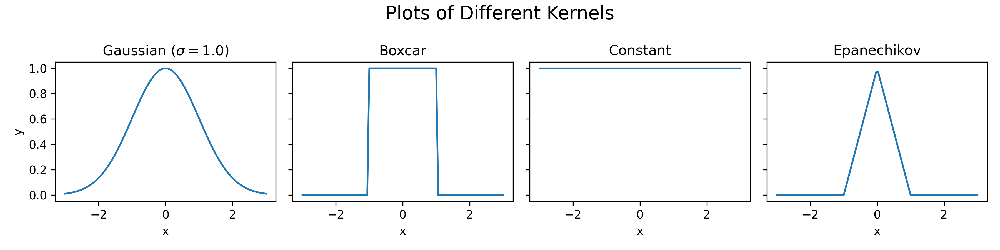
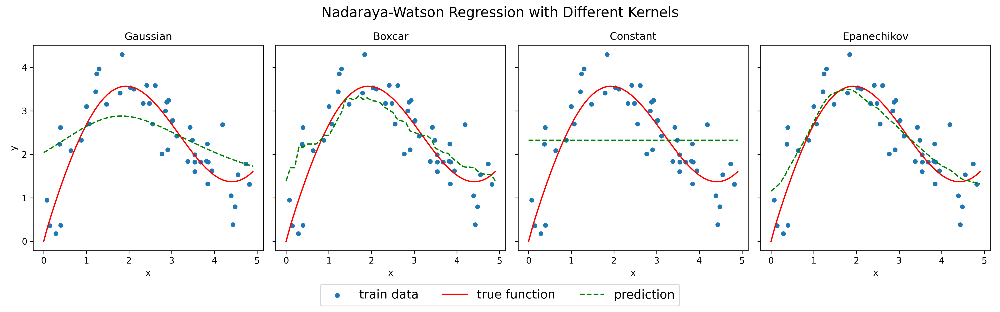
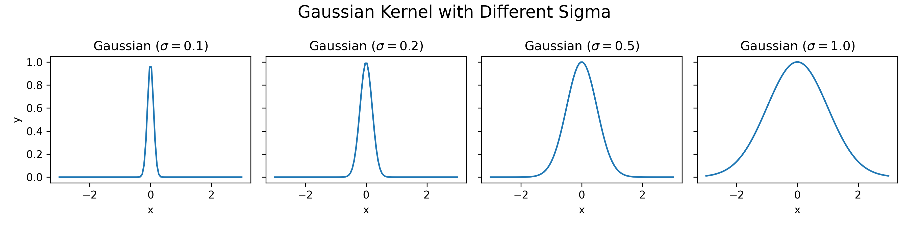
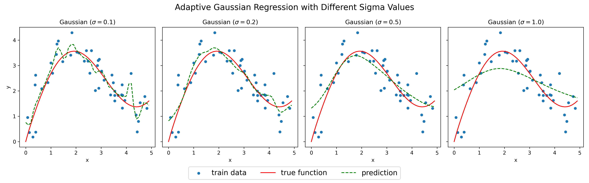

# Nadaraya-Watson Regression

This is a simple implementation of the [Nadaraya-Watson](https://en.wikipedia.org/wiki/Kernel_regression) regression algorithm in Python

## References

- [Attention Pooling: Nadaraya-Watson Kernel Regression](https://d2l.ai/chapter_attention-mechanisms-and-transformers/attention-pooling.html)
- [Kernel Regression](https://en.wikipedia.org/wiki/Kernel_regression)
