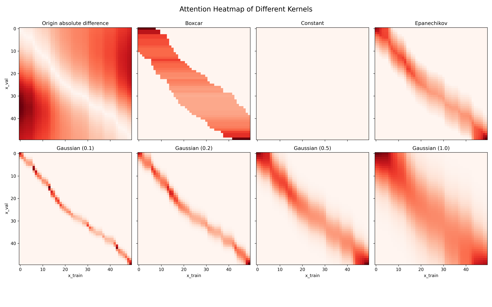

# Nadaraya-Watson Regression

This is a simple implementation of the [Nadaraya-Watson](https://en.wikipedia.org/wiki/Kernel_regression) regression algorithm in Python




## TODO

- [ ] Test different attention pooling methods

## References

- [Attention Pooling: Nadaraya-Watson Kernel Regression](https://d2l.ai/chapter_attention-mechanisms-and-transformers/attention-pooling.html)
- [Kernel Regression](https://en.wikipedia.org/wiki/Kernel_regression)

## Citation

```bibtex
@misc{nadaraya_watson_repo,
  author = {Dong, Linkang},
  title = {Nadaraya-Watson Regression},
  year = {2025},
  publisher = {GitHub},
  journal = {GitHub repository},
  howpublished = {\url{https://github.com/donglinkang2021/nadaraya-watson-regression}}
}
```
